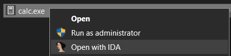

# OpenWithIDA

Add "Open with IDA" to your Windows context menu.

_OpenWithIDA_ efficiently determines a file's bitness, and proceeds to open it using the correct (32-bit or 64-bit) variant of IDA.



## Installation

```batch
pip install openwithida
```

You should now have _OpenWithIDA_ installed using the latest IDA version found on your PC.  
If not automatically found, you will be prompted to choose your IDA folder.

## FAQ

### The context menu item wasn't installed

To find out the cause for the error, run `pip install` with the `-v` flag.

Alternatively, run the installer manually (see below).

### How to run the installer manually?

If you want to specify a custom path for IDA or Python, run

```batch
python installer.py --help
```

(Even when `pip install` fails to install the context menu extension, `installer.py` should be available in the package's installation folder.)
